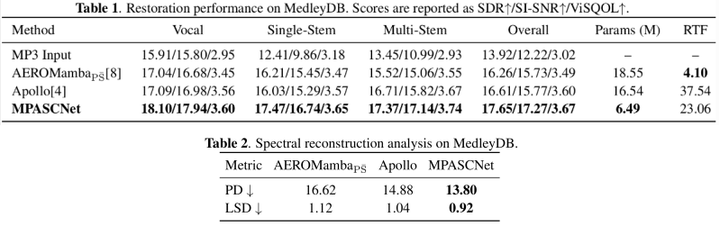

# MPASCNet: Magnitude-Phase-Aware Adaptive Spectral Compression for Compressed Music Restoration

PyTorch implementation of **MPASCNet**, a magnitude-phase-aware adaptive spectral compression network for compressed music restoration.

<p align="center">
  
</p>

## Results

<p align="center">
  
</p>

## Preparation

### Environment

We recommend using Python 3.10.

```bash
conda create -n mpascnet python=3.10
conda activate mpascnet
pip install -r requirements.txt
```

The following codec dependencies were used for MP3 data generation:

```bash
conda install -c conda-forge ffmpeg=5.0.1 sox=14.4.2 lame=3.100
```

ViSQOL is an optional dependency for perceptual quality evaluation. Please follow the installation instructions in the [official ViSQOL repository](https://github.com/google/visqol) if ViSQOL evaluation is required.

### Pretrained Checkpoint

The pretrained MPASCNet checkpoint is available on [Hugging Face](https://huggingface.co/Xinghour/MPASCNet).

Place the downloaded checkpoint under:

```text
checkpoint/
└── best
```

## Inference

### Single Audio

```bash
python inference.py --input path/to/input.mp3 --checkpoint_path checkpoint
```

The restored audio will be saved to `inference_results/` by default.

### Audio Folder

```bash
python inference.py --input path/to/audio_folder --checkpoint_path checkpoint
```

## Training

### Data Preparation

MPASCNet is trained using **MUSDB18-HQ** and **MoisesDB** following the data preparation protocol of Apollo.

The datasets can be obtained from:

- [MUSDB18-HQ](https://zenodo.org/records/3338373)
- [MoisesDB](https://music.ai/research/)

The preprocessing scripts are located in:

```text
data/create_train/
├── merge.py
├── moisesdb_preprocess.py
└── musdb_preprocess.py
```

The MUSDB18-HQ and MoisesDB preprocessing scripts are adapted from [Apollo-data-preprocess](https://github.com/JusperLee/Apollo-data-preprocess).

Set the corresponding dataset and output paths in `moisesdb_preprocess.py` and `musdb_preprocess.py`, and run:

```bash
python data/create_train/moisesdb_preprocess.py
python data/create_train/musdb_preprocess.py
```

After preprocessing, merge the two datasets. MoisesDB is used as the base dataset, while the MUSDB18-HQ HDF5 files of the overlapping stem categories are appended to the corresponding MoisesDB categories with continuous file indices. The MUSDB18-HQ mixture files are added separately.

```bash
python data/create_train/merge.py --moises_dir path/to/moises_hdf5 --musdb_dir path/to/musdb18hq_hdf5 --output_dir path/to/training_data
```

During training, active stems are randomly sampled and mixed, and MP3 compression is applied with bitrates randomly selected from 24, 32, 48, 64, 96, and 128 kbps.

### Validation Data

The validation data used during training can be prepared with:

```bash
python data/create_val.py --data_dir path/to/validation_source --output_dir path/to/validation_data
```

### Training

Start training with:

```bash
python train.py --train_dir path/to/training_data --eval_dir path/to/validation_data --checkpoint_path checkpoint
```

The main training configuration is defined in `config.json`. W&B logging is set to offline mode by default.

For multi-GPU training, specify the GPU IDs in `config.json`.

The best checkpoint and the latest training checkpoint are saved as:

```text
checkpoint/
├── best
└── latest
```

Training uses early stopping when the validation SI-SNR does not improve for 20 consecutive epochs.

## Evaluation

### Evaluation Data

The evaluation set is constructed from **MedleyDB**, which can be obtained from the [official MedleyDB download page](https://medleydb.weebly.com/downloads.html).

The evaluation data preparation scripts are located in:

```text
data/create_test/
├── create_test.py
└── delete_overlap.py
```

We first remove the 46 MedleyDB tracks that overlap with MUSDB18-HQ:

```bash
python data/create_test/delete_overlap.py --data_dir path/to/medleydb_audio
```

The script verifies that all 46 overlapping tracks are present before removing them. After removal, 150 non-overlapping tracks are retained for evaluation.

The evaluation data can then be generated with:

```bash
python data/create_test/create_test.py --data_dir path/to/medleydb_audio --metadata_dir path/to/medleydb_metadata --output_dir path/to/evaluation_data
```

We evaluate three conditions: **Multi-Stem**, **Single-Stem**, and **Vocal**. For each condition, 500 three-second excerpts are deterministically sampled and degraded using MP3 compression.

### SDR and SI-SNR

```bash
python inference.py --eval_dir path/to/evaluation_data --checkpoint_path checkpoint --output_dir inference_results
```

### PD and LSD

```bash
python losses/pdlsd.py --eval_dir path/to/evaluation_data --enhanced_dir path/to/inference_results --output_path pd_lsd.csv
```

### ViSQOL

After installing ViSQOL, run:

```bash
python losses/visqol.py --eval_dir path/to/evaluation_data --enhanced_dir path/to/inference_results --output_dir visqol_results
```

## Acknowledgements

The training data preprocessing scripts are adapted from [Apollo-data-preprocess](https://github.com/JusperLee/Apollo-data-preprocess).

MPASCNet builds upon ideas from prior work on magnitude-phase modeling, adaptive spectral feature compression, and spectro-temporal modeling. We thank the authors and contributors of Apollo, MP-SENet, Spectral Feature Compression, MUSDB18-HQ, MoisesDB, and MedleyDB.

## License

This project is released under the Apache License 2.0.
